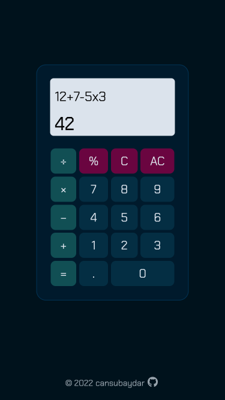
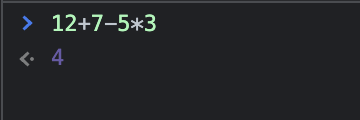

## Calculator

The purpose of this project, which is the last project of The Odin Project Foundations Course, is to create an on-screen calculator to improve JavaScript, HTML and CSS skills. 

#### The steps I followed for the project:
- Created functions called `add`, `subtract`, `multiply`, `divide` for the basic math operators. And created a function called `percentage` to calculate the percent of a number. 
- Created a function called `operator` that takes an operator and two numbers. Used the switch statement to operate according to the operator and to call one of the above math functions on the numbers. 
- Added an event listener to the buttons that calls the `calculate` function every time a button is clicked.
- Created a function called `calculate` that stores all the values and displays them on the screen. This function evaluates pairs of numbers and one operator at a time. For example, 12 + 7 - 5 * 3 = yields 42. 

Calculating this example on the browser console: 

- Added an error message to the screen when a number is tried to be divided by 0.
- Disabled the decimal button if there’s already one in the display. The answers with long decimals are rounded using the `toFixed()` method. 
- Created functions called `reset` that clears all the values and `clear` that deletes the display value.

Live preview is [here](https://cansubaydar.github.io/calculator/)